# 🧠MindMorbius

_让热爱成为驱动力，用 AI 释放创造力_ 

```mermaid
graph TD
    M["🧠 MindMorbius"] --> A["🎯 零门槛"] 
    M --> B["🤖 纯 AI"]
    M --> C["❤️ 全靠爱"]
    


    style M fill:#2b3252,stroke:#58A6FF,stroke-width:2px
    style A fill:#1B1F23,stroke:#4CAF50,stroke-width:2px
    style B fill:#1B1F23,stroke:#2196F3,stroke-width:2px
    style C fill:#1B1F23,stroke:#F44336,stroke-width:2px
```

## 

### 🎯 零门槛
- 不限技术水平
- 不限开发经验
- 不限编程语言

### 🤖 纯 AI
- 全面支持 AI 辅助开发
- 拥抱 AI 工具
- 共同探索 AI 潜力

### ❤️ 全靠爱
- 对技术充满热情
- 愿意学习成长
- 乐于分享交流

**[看看有没有感兴趣的项目，或者新建你感兴趣的项目](https://github.com/orgs/MindMorbius/repositories)** 🌟

