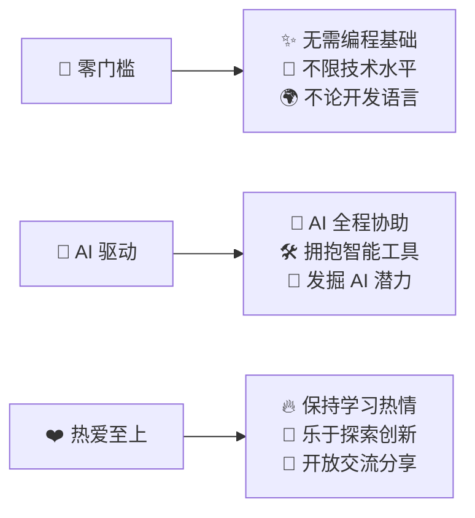

# 🧠 MindMorbius

## 🌟 我们的理念

## 🔥 项目施工中

### 💻 [DevPin](https://github.com/MindMorbius/DevPin)
> 开发、分解、追踪、效率

### 🔍 [NodePin](https://github.com/MindMorbius/NodePin)
> 一站式 | 订阅上传汇总分发

### 🎵 [MusicPin](https://github.com/MindMorbius/MusicPin)
> 音乐海 | 乐评交流站

### 🔍 [RKPin](https://github.com/MindMorbius/RKPin)
> 内容汇集 | AI对话

